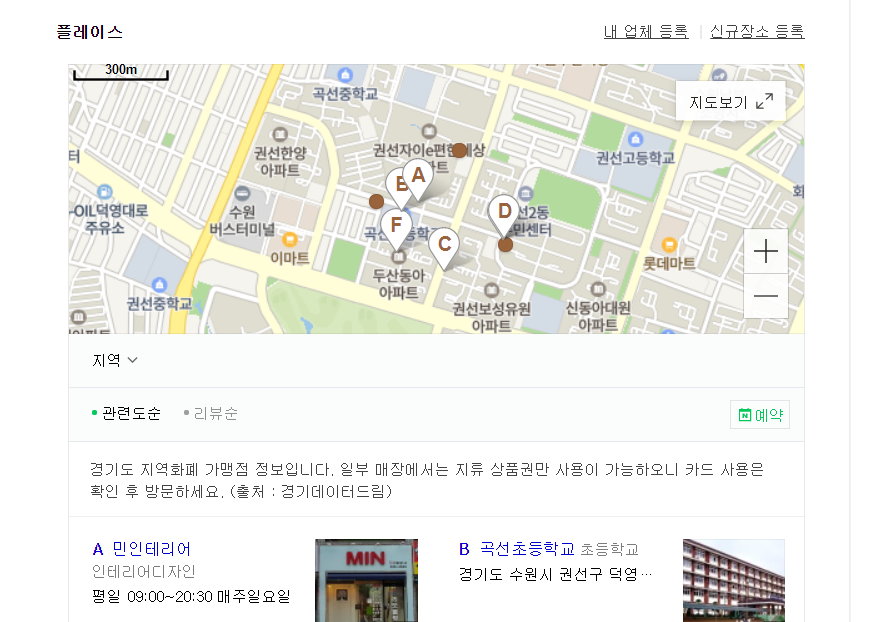
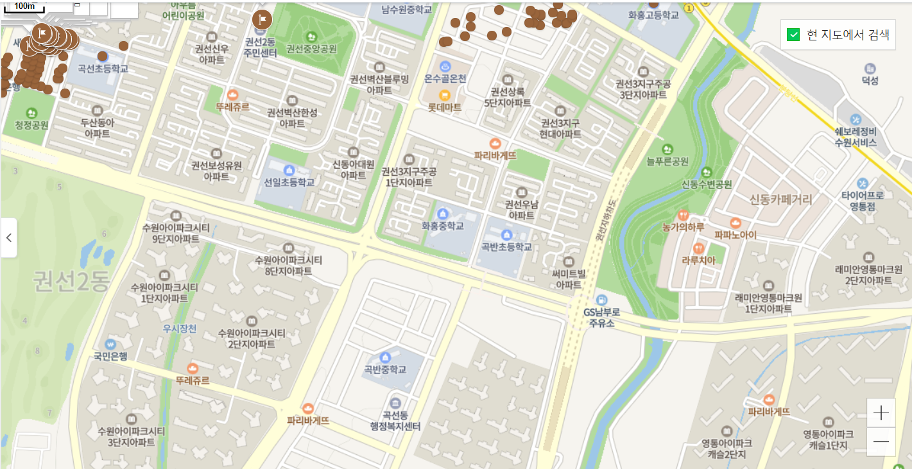
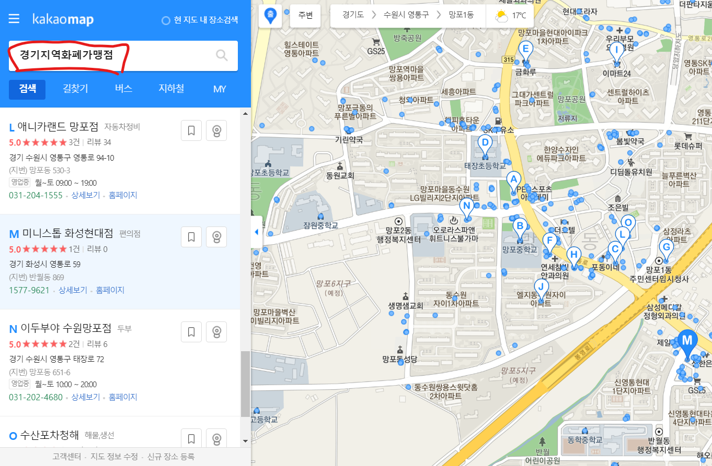
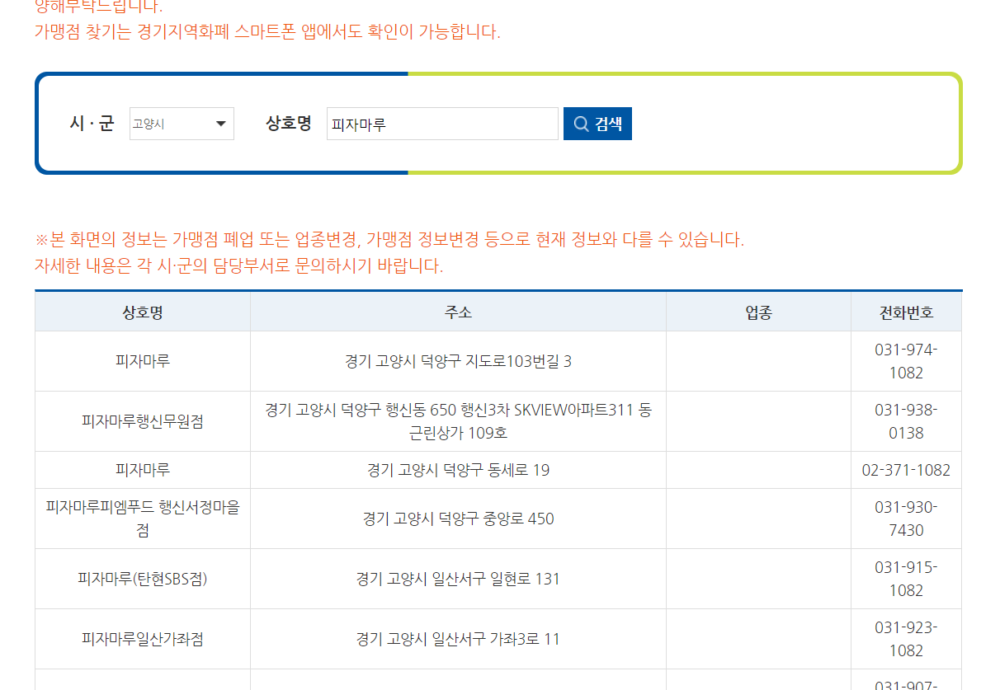
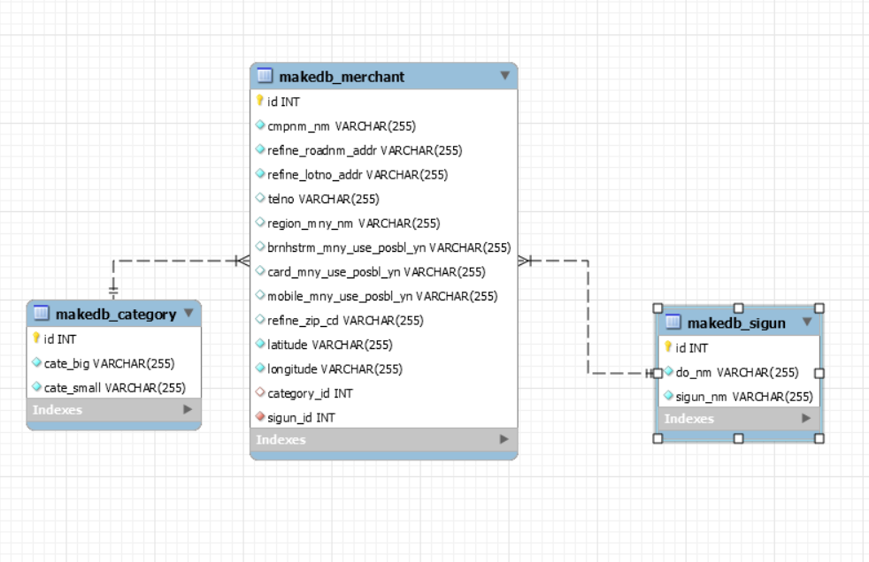
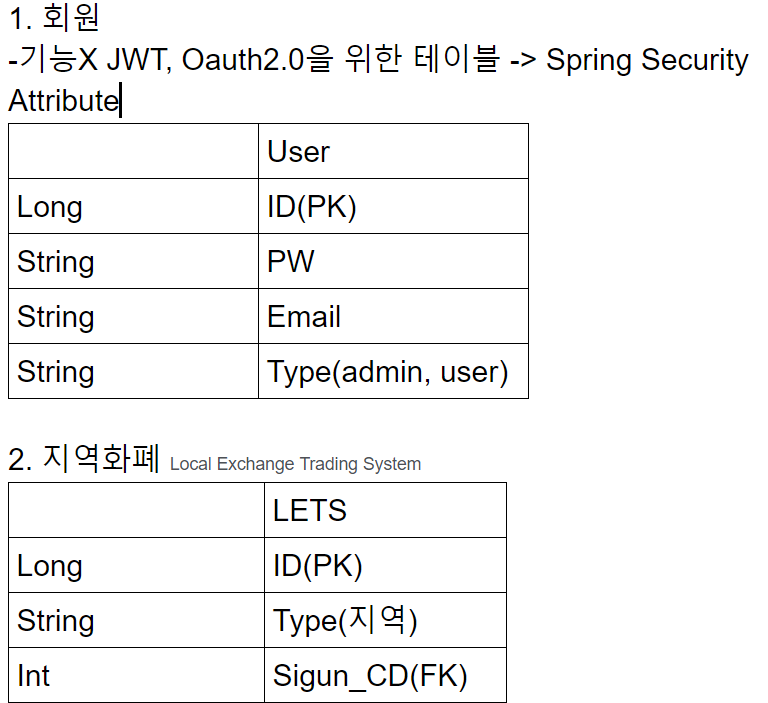
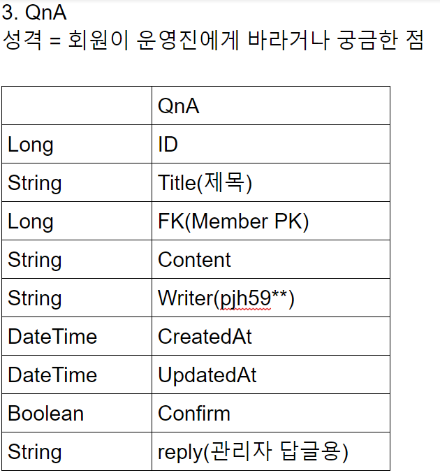
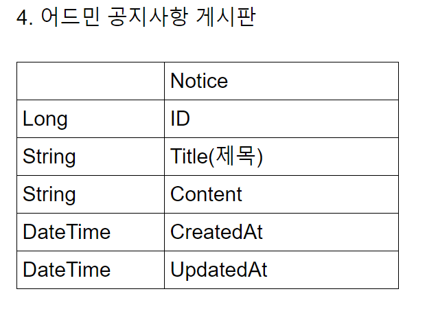

# 경기지역화폐 지도 프로젝트 

## 1. 기획서

### 1.1. 기획의도

- 코로나19의 여파로 지역경제가 무너지는 것을 막기 위해 경기도에서 모든 도민에게 지역화폐를 제공하는 복치정책을 펼쳤습니다. 뿐만 아니라 정부에서 발행한 `긴급재난지원금`또한 지역화폐로 발급받는 경우가 있어 지역화폐 가맹점 정보에 대한 수요가 커지고 있습니다. 
- 현재 경기도민 인구수만 **1,353만 명**이고 지역별 지원금액은 상이하지만 인당 평균 15~ 40만 원 까지 지원받고, 추가고 긴급재난 지원금까지 받으므로 어림계산하여 인당 50만 원을 받는다고 가정했을 때,  1,353만 명 * 50만원 = 약 **6조7천억 원** 정도의 소비를 강제할 수 있습니다. 
- 하지만 이러한 규모의 금전적 지원에 반하여 해당 화폐를 `어디서` 쓸 수 있는지에 대한 정보의 접근성은 매우 낮습니다. 이러한 접근성을 증진시켜 사용자 편의를 도모한 웹/앱 서비스를 기획합니다.

### 1.2. 시장분석

####  1.2.1. 네이버

- 위의 그림과 같이 현재 위치를 기준으로 가맹점 종류와 상관  없이 보여줍니다. `지도보기`버튼을 클릭하여 크게 보면 zoom의 상태에 따라 가맹점을 출력하는 개수가 달라지지만 위치를 제대로 잡지 못한다는 느낌을 받았습니다.

- 

  <포커스는 `화홍중학교`에 잡혀있지만 검색 결과는 엉뚱한 곳을 보여주는 모습>

#### 1.2.2. 다음

- 네이버와는 다르게 현재 위치를 기반으로 경기지역화폐 가맹점을 전체적으로 검색해준다는 느낌이 강합니다.
- 검색창에 `경기지역화폐가맹점` 이라는 키워드로 검색해서 편의성은 높았으나, 다른 키워드와 조합해서 검색할 수 없습니다.

#### 1.2.3 경기지역화폐 공식홈페이지

- 시, 군 으로 구분하고, 가맹점 이름으로 검색하는 기능이 있지만 지도로 표현하는 기능이 없어 사용자 측면에서 불편함이 존재합니다.

  

### 1.3. 청사진

- 핵심 기능은 사용자 편의에 촛점을 둔, 검색 서비스 입니다.

#### 1.3.1  ui적 접근성

- 웹 상에서 카테고리별 이미지를 우측 상단, 혹은 좌측 상단에 배치하여 원하는 카테고리별 분류를 보여줍니다.
- 내가 사용할 수 있는 카드(지역)를 choice bar가 아닌 지도로 선택하기 기능을 부여해 쉬운 조작감을 제공할 예정입니다.

#### 1.3.2 검색기능의 개선

- 경기지역화폐 공식홈폐이지의 검색기능 + 다음 카카오의 지도ui를 입혀 사용자로 하여금 불편함이 없는 서비스를 기획합니다.
- 가능하다면 키워드, 지역, 카테고리, 등 손쉽게 검색하는 기능을 제공하고자 합니다,(심봉사 검색기능 + @ 였으면 좋겠습니다만 이건 설계상에서 다시 얘기해봐야 겠죠)

#### 1.3.3 기타

- 만약 가계부 기능이나, 예약, 리뷰 등 부가기능을 추가한다면 어떨까요? 이건 회의를 통해 확장해보는게 좋을것 같습니다. 

## 2. 작업 컨벤션

### 2. 1 Jira Naming Convention

- **[Front-end] or [Back-end] 앞에 쓰기**
- **에픽을 계층적으로 생성해서 할당하기**
- 예시
  - 에픽네이밍 :` [Front-End][Css관리]`
  - 작업네이밍 : `[Front-End][React Component]지도`

### 2. 2 Branch Naming Convention

- 스네이크 케이스를 기반으로한다.
- 백앤드 or 프론트 앤드 / 피처 / 기능의 규칙으로 생성한다.
- 예시
  - `front_end/feature/map_component`
  - `back_end/feature/user_api`

### 2.3 Git Commit Naming Convention

- 다음과 같은 prefix를 붙이고 뒤에 추가 설명을 쓴다.
- prefix
  - feat : 새로운 기능 추가
  - fix : 버그 수정docs : 
  - 문서 수정
  - style : 코드 포맷팅, 세미콜론 누락, 코드 변경이 없는 경우
  - refactor : 코드 리펙토링
  - test : 테스트 코드, 리펙토링 테스트 코드 추가
  - chore : 빌드 업무 수정, 패키지 매니저 수정
- 예시
  - `refactor: ui 개선`
  - `style: 지도 컴포넌트 css 작업`
  - `feat : 회원가입 폼 추가`

## 3. ERD

### 3.1. 현재까지 구축한 erd(아직 완성본 아님)

### 3. 2. 앞으로 추가할 table

